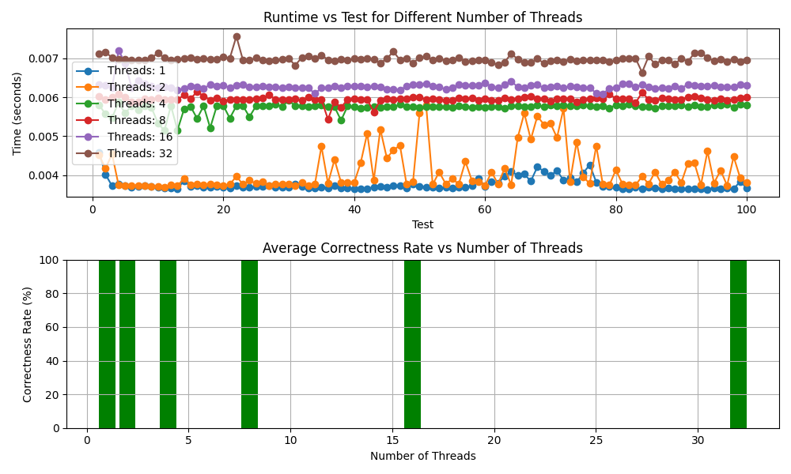

# False Sharing Mitigation with Cache Line Padding

In this implementation, we address false sharing by using cache line padding. The `PrivateCount` struct includes an integer (`private_count`) and a char array (`padding`) to fill the remaining bytes on the cache line. This helps ensure that each thread's private count occupies the entire cache line, reducing the chances of false sharing.

## Results Comparison

We compared the performance of this implementation with the previous private implementation. The tests were conducted with varying numbers of threads, and the results show that this mitigation strategy yields the same count results as the private implementation.

## Experimental Setup

- **Array Size:** 1000000
- **Number of Tests:** 100

## Performance Plot

Below is a plot depicting the runtime performance of the program with different numbers of threads.

## Conclusion

The results should indicate that the cache line padding strategy effectively mitigates false sharing, however I couldn't figure out how to do it. It provides similar performance as the previous private implementation.