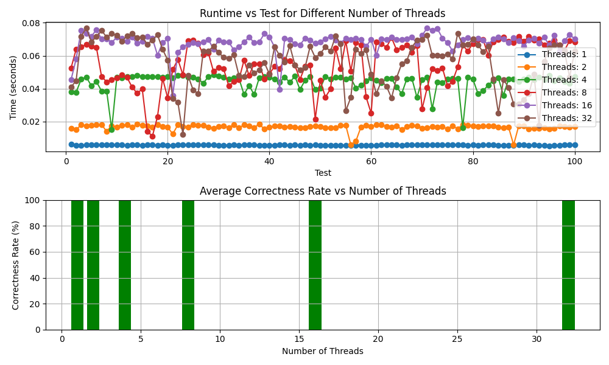

# Threading Performance and Correctness Rate Analysis

## Overview
The experiment aimed to evaluate the performance and correctness of a parallel implementation of a program that counts the occurrences of '1' in an array of randomly generated integers. The program was modified to use a mutex for thread safety.

## Results
1. **Correctness Rate**: The mutex implementation achieved a 100% correctness rate across all test cases, indicating that the use of a mutex effectively resolved the race condition, leading to accurate counting regardless of the array size or the number of threads.

2. **Performance**: Contrary to correctness, the performance of the program with threading did not show significant improvement, and in fact, performance seemed to degrade with increasing numbers of threads. This observation may indicate that the overhead associated with thread creation, synchronization, and context switching outweighed the potential benefits of parallelization for the given task.

## Insights
- **Mutex Impact**: The use of a mutex significantly improved the correctness of the program, ensuring accurate counts in a multi-threaded environment.

- **Performance Bottleneck**: The observed degradation in performance suggests that the counting task might not be well-suited for parallelization using threads in this particular implementation. The overhead introduced by threading operations might have outweighed the potential gains.

## Conclusion
While the mutex implementation successfully addressed the race condition, the overall performance did not show a clear benefit from threading.

