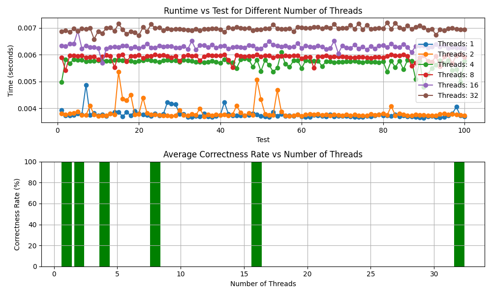

# Performance Improvement with Private Counts

## Results

The program utilizing private counts exhibited significantly improved performance compared to the mutex-based implementation. The generated plot visually illustrates the runtime differences across various test scenarios.

## Possible Explanations

The observed performance improvement can be attributed to the reduced contention for shared resources. In the mutex-based program, threads contend for access to a shared counter variable, leading to potential bottlenecks and increased waiting times. On the other hand, the program with private counts allows each thread to independently compute its count without the need for synchronization, minimizing contention and enabling more efficient parallel processing.